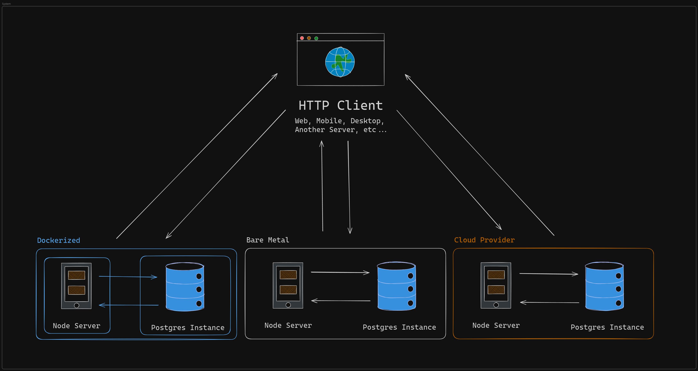
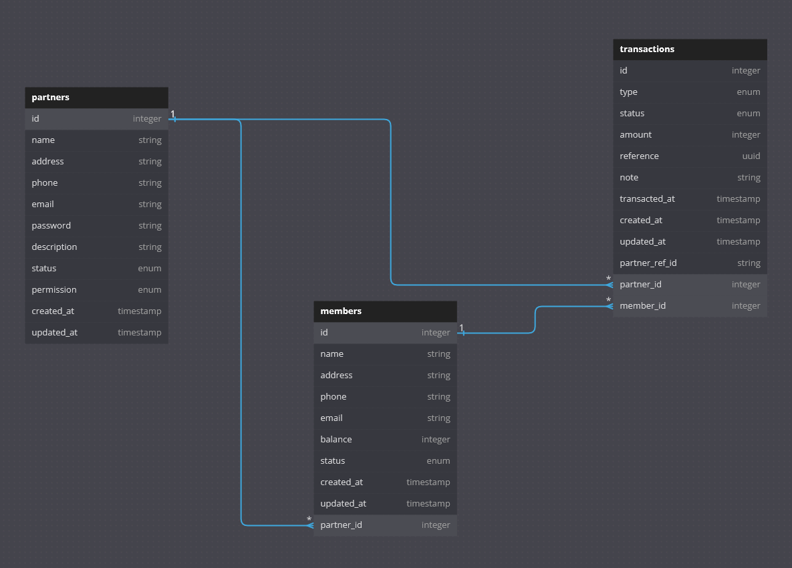

# [**Pay With Pretend Points API**](https://paywithpretendpointsapi.onrender.com/) 💸 

Manage and earn points in a loyalty and rewards system.


## **Table of Contents** 📚

- [**Requirements**](#requirements) 🖥️<br/>
- [**Getting Started**](#getting-started) 🚀<br/>
- [**Development**](#development) 🛠️<br/>
- [**Commands**](#commands) 🤖<br/>
- [**Architecture**](#architecture) 🏠<br/>
- [**Contributors**](#contributors) ✨ <br/>

## **Requirements** 🖥️

- **You will need [`Node.JS`](https://nodejs.org/en/download/package-manager/current) version `22.7.0` installed if you're not running via Docker, this will also install the required [`npm`](https://www.npmjs.com/) version `10.8.2`:**

  ```json
  "engines": {
    "node": "22.7.0",
    "npm": "10.8.2"
  },
  ```

- **Otherwise you will need [`Docker`](https://www.docker.com/products/docker-desktop/) installed to run this in a container.**

## **Getting Started** 🚀

### **Without Docker**

1. **Clone the repository:**

   ```bash
   git clone https://github.com/HackTheNorth-FakeWithPoints/PayWithPretendPointsAPI.git

   cd PayWithPretendPointsAPI
   ```

2. **Install dependencies:**

   ```bash
   npm install
   ```

3. **Run the server in development mode:**

   ```bash
   npm run dev
   ```

### **With Docker**

1. **Clone the repository:**

   ```bash
   git clone https://github.com/HackTheNorth-FakeWithPoints/PayWithPretendPointsAPI.git

   cd PayWithPretendPointsAPI
   ```

2. **Build the image and start the containers:**

   ```bash
   docker compose -f docker-compose.local.yml up --build
   ```

## **Development** 🛠️

### **Contributing**

**Commits must follow the format of:**

`feat|fix|chore|docs|test|style|refactor|perf|build|ci|revert:(<scope>): "Your commit message here."`

```bash
git commit -m "feat(app): initial commit"

git commit -m "feat: initial commit"
```

### **Database**

**Install [Postgres](https://www.postgresql.org/download/) or spin up a local database instance via Docker:**

`Note: this is only if you want a standalone database and you're running the API without docker.`

```bash
docker compose -f docker-compose.local.db.yml up --build
```

**Sequelize migration template:**

```js
'use strict'

module.exports = {
  /**
   * @param {import('sequelize').QueryInterface} queryInterface
   * @param {import('sequelize').Sequelize & import('sequelize').DataTypes} Sequelize
   * @returns {Promise<void>}
   */
  up: async (queryInterface, Sequelize) => {
    // your migration creation here...
  },
  /**
   * @param {import('sequelize').QueryInterface} queryInterface
   * @returns {Promise<void>}
   */
  down: async (queryInterface) => {
    // your migration revert here...
  }
}
```

## **Commands** 🤖

### **Custom Commands**

**Run the `migrate` command to apply database migrations:**

```bash
npm run migrate
```

**Run the `migrate:revert` command to revert database migrations:**

```bash
npm run migrate:revert
```

**Run the `swagger` command to generate oas.yml:**

```bash
npm run swagger
```

**Run the `validate` command to check errors and if build passes:**

```bash
npm run validate
```

**Run the `format` command to fix errors and check the build:**

```bash
npm run format
```

**Run the `build` command to create a production build of the app:**

```bash
npm run build
```

**Run the `start` command to start the app with a production build:**

```bash
npm run start
```

### **Utility Commands (NPM)**

```bash
# install dependencies specified in package.json
npm install

# check for latest minor and patch versions of dependencies
npm outdated

# update all outdated dependencies to latest minor and patch versions
npm update

# check for unused dependencies (devDependencies and imports can be ignored)
npx depcheck

# update all dependencies to latest major version (breaking changes may occur)
npx npm-check-updates -u
```

### **Utility Commands (Docker)**

```bash
# remove all containers
docker system prune --force --all

# remove all volumes
docker volume prune --filter all=1
```

## **Architecture** 🏠

### **System Diagram**



### **Database Schema**



## **Contributors** ✨

**Big thanks to the team for making this possible!**

<style>
    table {
        width: 100%;
    }
</style>

| Name                  | GitHub Handle                                      | Role                         |
| --------------------- | -------------------------------------------------- | ---------------------------- |
| **Geoffrey Peart**    | [@GeoffreyPeart](https://github.com/GeoffreyPeart) | Lead Organizer and Developer |
| **Tony Liu**          | [@szboynono](https://github.com/szboynono)         | Lead Organizer and Developer |
| **Bryan Peart**       | [@BryanPeart](https://github.com/BryanPeart)       | Developer                    |
| **Sachin Chandwani**  | [@Sachin-c](https://github.com/Sachin-c)           | Developer                    |
| **Tapiwa Kundishora** | [@tapiwakundi](https://github.com/tapiwakundi)     | Developer                    |
| **Jacky Tea**         | [@jackytea](https://github.com/jackytea)           | Developer                    |
